# 🏢 SocietyPro - Premium Society Management System

**SocietyPro** is a state-of-the-art, full-stack web application designed to streamline the administration and financial management of modern residential societies. It provides a seamless experience for administrators, staff, and residents alike.

---

## 🚀 Key Features

### 🔐 Advanced Security & Access Control
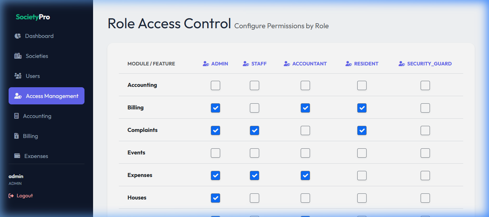
- **Role-Based Access Control (RBAC):** Dedicated interfaces for Admins, Staff, Accountants, and Residents.
- **Dynamic Feature Management:** Admins can dynamically enable or disable specific modules (Billing, Complaints, Societies, etc.) for entire roles via a real-time dashboard.

### 📊 Executive Analytics & Reporting
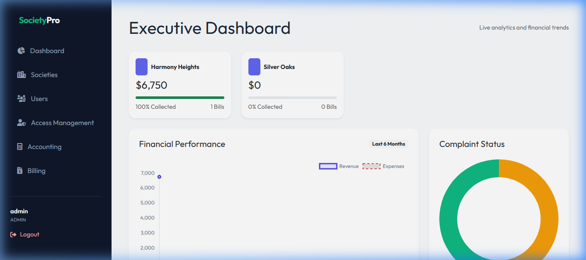
- **Interactive Dashboards:** Real-time financial trends using Chart.js, including Revenue vs. Expenses and Collection Efficiency.
- **Advanced Reporting:** High-performance CSV export engine with filtering by Society, Date Range (including FY presets), and Payment Status.
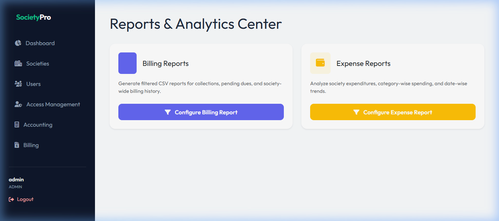
- **Accounting Hub:** Centralized financial overview tracking Net Balance, Total Receivables, and category-wise expenditure.
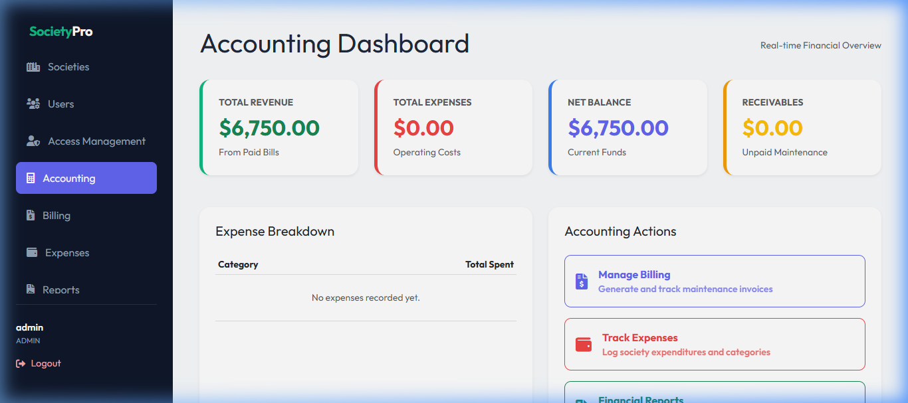

### 💳 Financial & Billing Management
- **Automated Billing:** Generate maintenance bills based on fixed charges and area-based rates.

- **Razorpay Integration:** Secure online payment gateway with automated verification and mock-mode for testing.
- **Professional PDF Invoices:** Automated generation of professional invoices with "PAID" verification stamps and payment dates.
- **Expense Tracking:** Comprehensive log of society expenditures with dynamic category management.
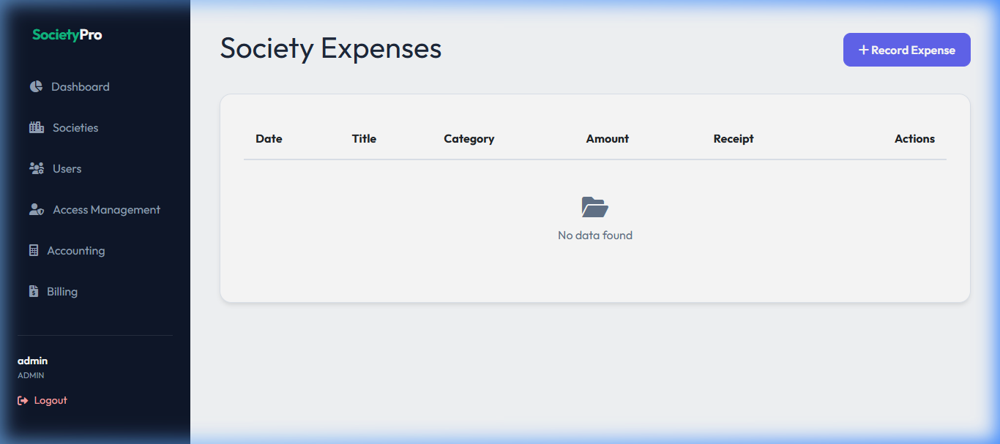

### 🏠 Property & Master Data Management
- **Settings Module:** Complete control over global app settings (App Name, Currency) and Master Data (Expense Categories, House Types).
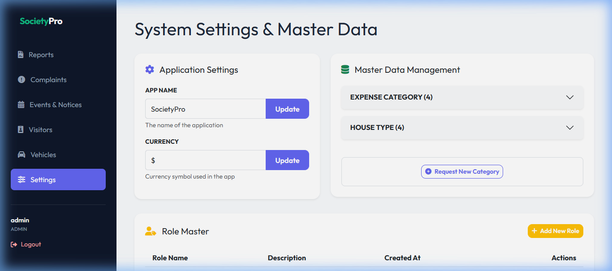
- **Society Hierarchy:** Manage multiple societies with their specific addresses and registration details.
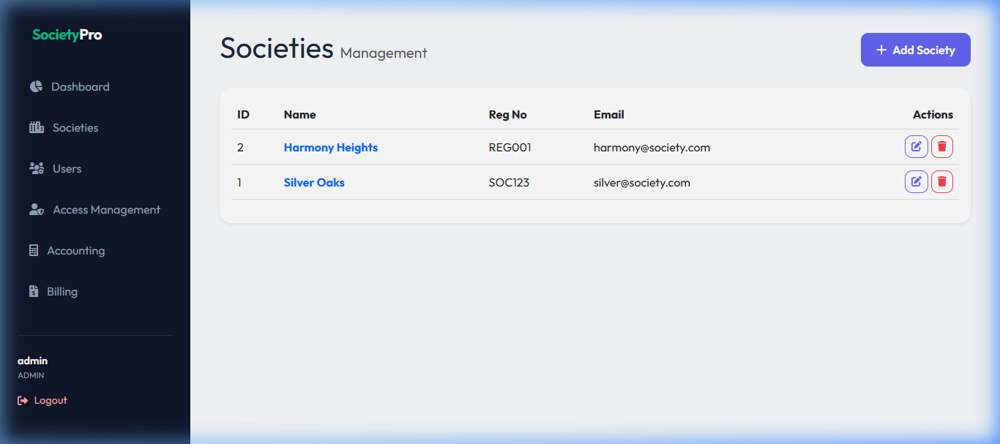
- **House Management:** Track wings, house numbers, area square footage, and resident contact details.
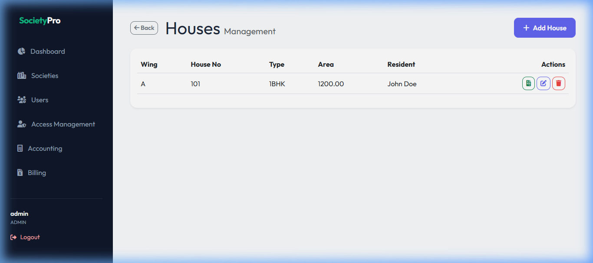
- **Vehicle & Parking Management:** Track resident vehicles (cars/bikes) and strictly manage parking slot allocations.
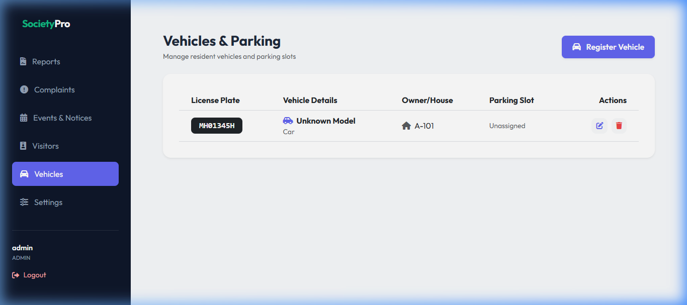

### 🛠️ Resident Services & Community
- **Complaint Helpdesk:** Residents can file complaints, upload documents, and track resolution status in real-time.
- **Events & Notices:** Broadcast society gatherings, meetings, and important announcements with date/time tracking.
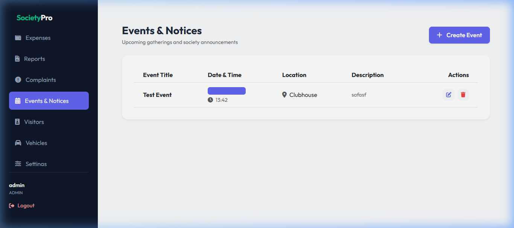
- **Visitor Security Logs:** Digital register for tracking the entry and exit of guests, delivery agents, and staff.
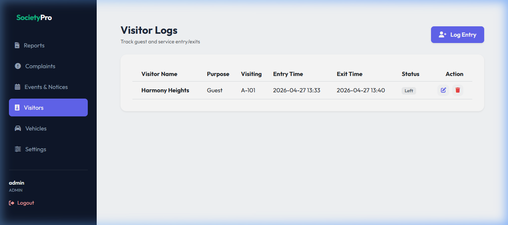
- **Auto-Onboarding:** Automated user registration and welcome invitation emails when a new house is registered.

### 🎨 Premium User Experience
- **Modern UI/UX:** Built with Bootstrap 5 and custom CSS for a clean, glassmorphism-inspired aesthetic.
- **Data Grids:** Clean, responsive table layouts for all data management with consistent "Empty State" designs.
- **Interactive Notifications:** Replaced generic browser popups with elegant Bootstrap Toasts and Confirmation Modals.
- **Global API Loaders:** Centralized AJAX interceptors that automatically display loading spinners during backend interactions.
- **Smart Navigation:** Auto-scrolling sidebar that natively detects and centers the active route using JavaScript `scrollIntoView`.

---

## 🛠️ Technology Stack

- **Backend:** Python (Flask Framework)
- **Database:** PostgreSQL (SQLAlchemy ORM)
- **Frontend:** HTML5, CSS3, Bootstrap 5, **jQuery**
- **Visualization:** Chart.js
- **Payment Gateway:** Razorpay SDK
- **Reporting:** fpdf2 (PDF Generation)
- **Authentication:** Flask-Login

---

## 📂 Project Structure

```text
society_maintenance/
├── dev3/                   # Core Application Source
│   ├── bl/                 # Business Logic (Reporting, Expense, Maintenance)
│   ├── common/             # Config, DB Setup, & Auth Utilities
│   ├── handler/            # Flask Blueprints (API & Page routes)
│   ├── sql/                # SQL Query Library
│   └── ui/                 # Frontend Assets
│       ├── static/         # CSS, Images, & Modular JS Files
│       └── templates/      # Jinja2 HTML Templates
├── run.py                  # Application Entry Point
├── seed.py                 # Initial Database Seeding Script
└── requirements.txt        # Python Dependencies
```

---

## ⚙️ Installation & Setup

1. **Clone the repository** and navigate to the project root.
2. **Setup Virtual Environment:**
   ```bash
   python -m venv venv
   venv\Scripts\activate
   ```
3. **Install Dependencies:**
   ```bash
   pip install -r requirements.txt
   ```
4. **Initialize Database:**
   Ensure PostgreSQL is running, then seed the initial data:
   ```bash
   python seed.py
   ```
5. **Run the Application:**
   ```bash
   python run.py or 
   .\venv\Scripts\python run.py
   ```
   Access the app at `http://127.0.0.1:5000`

---
6. Activate the virtual environment
.\venv\Scripts\activate
7.Start the server
python run.py

## 👨‍💻 Contributing
This project is architected for scalability. To add a new feature:
1. Define the SQL in `dev3/sql/`.
2. Implement Business Logic in `dev3/bl/`.
3. Create a Route Handler in `dev3/handler/`.
4. Register the Blueprint in `dev3/__init__.py`.